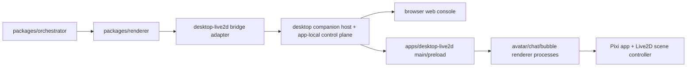

# Renderer Architecture

## Purpose

This document defines the architecture for Echo's renderer line.

Its job is to keep four layers explicit:

1. Python-side typed renderer core
2. browser-served web console
3. desktop app shell
4. scene runtime inside the desktop app

That split is mandatory because the first backend is cross-language, but Echo's
package boundaries still belong to the Python core.

---

## Reference Model

Echo now uses a UI-fidelity reference model for the renderer line:

- `open-yachiyo`
  - primary reference for:
    - browser console UI under `apps/gateway/public`
    - Electron desktop UI under `apps/desktop-live2d`
- `AIRI`
  - secondary reference where later Pixi/Live2D scene internals need
    comparison

Reference sources may now be directly inspected for UI-surface reproduction
under Echo's governance exception, but they still must not override Echo
protocol or package boundaries.

---

## Four-Layer Split

### Layer 1: `packages/renderer`

Owns:

- typed renderer-local models
- adapter port
- adapter registry
- renderer service facade
- typed failure normalization

Does not own:

- Electron lifecycle
- browser UI
- Pixi stage
- model assets

### Layer 2: Browser Console

Owns:

- browser-served `chat`
- browser-served `config-v2`
- browser-served `onboarding`
- provider/settings UI
- readiness/debug UI

Does not own:

- protocol semantics
- runtime composition
- floating desktop window behavior

### Layer 3: `apps/desktop-live2d`

Owns:

- Electron main/preload shell
- local app-owned bridge/control-plane routing
- app lifecycle and smoke startup
- relative asset-path validation at the app boundary
- app-side bubble window
- app-side floating chat window
- app-side playback ownership and playback-facing UI state

Does not own:

- orchestrator policy
- runtime state
- protocol semantics

### Layer 4: Scene Runtime

Owns:

- Pixi canvas/runtime bootstrap
- Live2D full-body model load/unload
- state/expression/motion execution
- app-side audio-driven lipsync shell
- later local scene features such as resize/edit-mode UI

Does not own:

- network transport policy
- session progression
- browser console behavior

---

## Post-Task65 Reality

The following renderer milestones are already real:

- typed renderer dispatch in `packages/renderer`
- real `TurnOrchestrator` -> `RendererService` dispatch
- a concrete `desktop-live2d` bridge and app shell
- a deterministic scene controller for supported command types
- a bounded bubble shell
- a desktop-owned playback bridge and typed playback truth shell
- a single-session desktop companion session service
- a current-session chat panel prototype
- an app-side audio-driven lipsync shell

That means the next visible-demo blockers are no longer "renderer foundation",
"make the model move", or "make the desktop demo runnable". The next blockers
are:

- governance support for high-fidelity UI reproduction
- browser-served web console recreation
- corrected `avatar + chat + bubble` floating desktop suite
- synchronized multi-surface demo verification

---

## First Backend Target

The first concrete renderer backend is explicitly:

- Electron + PixiJS + Live2D runtime wrapper
- one full-body standing character window
- repo-owned relative model assets

The current backend supports:

- `set_state`
- `set_expression`
- `set_motion`
- `clear_expression`

The backend still must not claim complete support for:

- `set_mouth_open`
- public generic lip-sync semantics

Those remain outside the renderer-command contract even though app-side shells
now exist.

---

## Support Matrix For First Backend

| Concern | Owner | Current status |
|---|---|---|
| typed renderer dispatch | `packages/renderer` | completed |
| orchestrator integration | `packages/orchestrator` | completed |
| Electron app shell | `apps/desktop-live2d` | completed |
| full-body model load | scene runtime | completed |
| motion/expression/state execution | scene runtime | completed |
| browser web console | app-local web surface | next |
| avatar/chat/bubble suite | app shell | next |
| real device audio output | app shell | accepted backend work |
| real Pixi/Cubism app-mode runtime | scene runtime | accepted backend work |
| alternate backends | later tasks | deferred |

---

## Guardrails

- The Python core must not embed Pixi or Live2D directly.
- The desktop app must not import Python runtime internals directly.
- The browser console must not redefine protocol or runtime semantics.
- The scene controller must not invent new renderer command semantics.
- Unsupported commands must fail explicitly instead of being silently ignored or
  faked as success.
