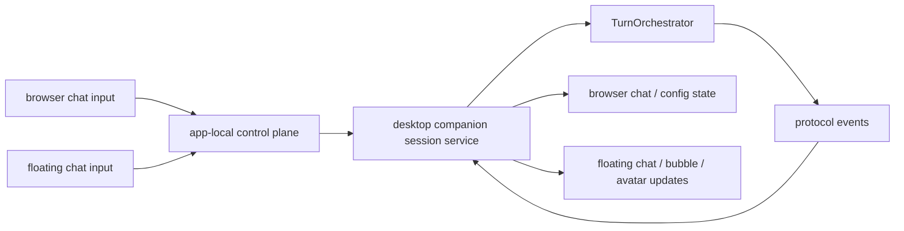

# Desktop Companion Session Service

## Purpose

This document defines the first runnable-demo composition root above Echo's
already-real llm, orchestrator, tts, renderer, and desktop bridge lines.

The goal is not to redesign runtime core. The goal is to create one explicit
single-session service that can wire the existing subsystems into a real
desktop turn loop.

Current status:

- implemented and accepted by task54
- still used as the single-session composition root through the UI reset
- intentionally kept narrow so browser-console and floating-window work can
  reuse it without redesigning runtime core

---

## Why This Lives In `packages/runtime`

This service belongs in `packages/runtime` because it is a lifecycle and
entrypoint concern:

- it wires already-approved subsystem seams together
- it owns one session-level turn entrypoint
- it coordinates app-facing state and settlement around a session

It is not:

- a new orchestrator strategy layer
- a new renderer adapter layer
- a new TTS provider layer

---

## First Demo Responsibilities

The desktop companion session service should own:

- wiring `LLMService`
- wiring `TurnOrchestrator`
- wiring `TTSService`
- wiring `RendererService`
- wiring the concrete desktop renderer bridge
- wiring the concrete desktop audio sink
- exposing one session-level entrypoint such as `run_text_turn(...)`
- consuming orchestrator protocol events to drive:
  - bubble updates
  - transcript updates
  - playback settlement coordination
- exposing one full-duplex bridge/session boundary so app-originated input can
  re-enter Python cleanly

---

## Single-Session Rule

The current desktop demo remains explicitly single-session.

That means this service should:

- own one active session id
- own one desktop bridge/session
- own one current transcript
- own one current turn pipeline

It should not grow into:

- a multi-session desktop manager
- a generic operator shell
- a standby/presence scheduler

---

## Full-Duplex Boundary

The product surfaces now need to do more than receive commands from Python.

The corrected demo should support both directions:

Required properties:

- browser and floating desktop inputs are typed and explicit
- Python-side handling stays session-scoped
- transcript and bubble updates are derived from orchestrator-owned outputs,
  not invented UI-side guesses

---

## What This Service Must Not Do

The desktop companion session service must not:

- redesign runtime core state application
- become a multi-session registry replacement
- invent new protocol semantics
- absorb standby/presence logic
- absorb screenshot or multimodal workflow
- absorb browser/Electron layout responsibilities

Those belong to later tasks after the corrected product surfaces exist.

---

## Next Step Above This Service

The next UI-facing work should stay above this service:

- browser-served provider/source settings
- browser-served chat, config-v2, and onboarding surfaces
- floating avatar/chat/bubble windows
- app-local control-plane sync between browser and Electron surfaces

That next step must not move provider parsing logic or UI state down into
runtime core or change the session-service boundary itself.
