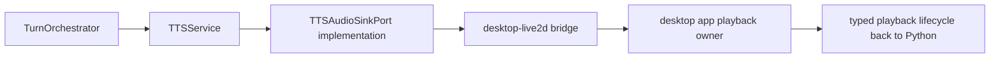

# Desktop Playback Bridge

## Purpose

This document defines the first real playback path above `packages/tts`.

The goal is to move Echo from "orchestrator reconciles playback locally after
audio-fragment delivery" into "the desktop app materially owns playback start,
finish, and abort truth" for the first runnable demo.

Current status:

- the typed desktop playback bridge shell is implemented by task53
- the current app-side backend still uses a bounded headless playback path for
  deterministic verification
- the next step is to keep the same typed bridge while landing real device
  output in app mode

---

## Core Rule

`packages/tts` stops at ordered `TTSAudioFragment` output.

It must not:

- own speaker playback
- own playback lifecycle truth
- own lip-sync analysis
- own desktop delivery policy

Those concerns belong above `packages/tts`.

---

## First Demo Ownership Split

`packages/tts` owns:

- synthesis request normalization from `TTSChunk`
- provider/profile/voice resolution
- provider transport and error normalization
- ordered `TTSAudioFragment` output

`packages/orchestrator` owns:

- when a `TTSChunk` is emitted
- audio mutex ownership
- interrupt and queue policy
- how playback lifecycle affects turn resolution

`apps/desktop-live2d` owns:

- actual audio playback
- playback buffering mode for the first demo
- playback lifecycle truth:
  - started
  - finished
  - aborted
  - failed
- later app-side lip-sync analysis

`packages/runtime` demo-composition services may own:

- wiring playback lifecycle back into a runnable demo session
- coordinating desktop transcript/bubble updates with playback settlement

---

## Bridge Shape

The first concrete playback bridge should remain above `packages/tts` and
reuse the existing local desktop bridge direction:

Required consequences:

- synthesized fragments travel to the desktop app through Echo-owned typed
  bridge commands
- playback lifecycle comes back through Echo-owned typed reporting
- orchestrator/runtime use that lifecycle instead of inventing new silent local
  guesses

---

## First Runnable Demo Rules

- single-session only
- desktop app owns real playback
- keep playback sink above `packages/tts`
- do not redesign provider interfaces
- do not fold lip-sync into the initial playback bridge task

---

## What This Bridge Must Not Do

The first playback bridge must not:

- move playback into `packages/tts`
- redesign `AudioMutex`
- redesign protocol `TTSChunk`
- introduce multi-session desktop policy
- claim lip-sync is already implemented

Those belong to later layers.
